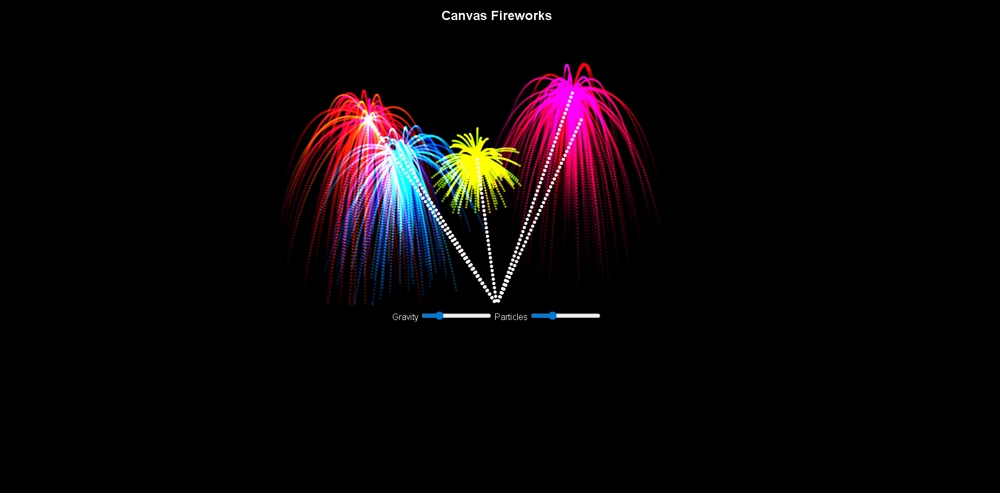

# Laboratorium 03 - System cząsteczkowy: Fajerwerki w HTML5 Canvas

## Temat ćwiczenia
Implementacja interaktywnego systemu cząsteczkowego przedstawiającego pokaz fajerwerków z wykorzystaniem HTML5 Canvas oraz JavaScript ES6.

## Cel ćwiczenia
Celem laboratorium było:
- zapoznanie się z działaniem systemów cząsteczkowych,
- implementacja prostego modelu fizycznego dla wielu obiektów,
- zastosowanie programowania obiektowego w JavaScript,
- zarządzanie cyklem życia obiektów,
- obsługa animacji w czasie rzeczywistym,
- dodanie interakcji użytkownika oraz sterowania parametrami symulacji.

## Opis programu
Program przedstawia animowany pokaz fajerwerków na elemencie `canvas`. Na stronie znajduje się obszar rysowania oraz panel sterowania z dwoma suwakami: grawitacji i liczby cząsteczek.

Symulacja działa w czasie rzeczywistym i obejmuje:
- start rakiety z dolnej części ekranu,
- lot rakiety do wybranego punktu,
- eksplozję w wiele cząsteczek,
- ruch cząsteczek pod wpływem grawitacji,
- stopniowe zanikanie cząsteczek,
- odbicie cząsteczek od dolnej krawędzi canvasa,
- automatyczne generowanie kolejnych fajerwerków.

Projekt został zrealizowany z użyciem trzech klas:
- `Particle` - reprezentuje pojedynczą cząsteczkę,
- `Firework` - reprezentuje rakietę i jej eksplozję,
- `FireworkShow` - zarządza całą symulacją, zdarzeniami oraz rysowaniem. :contentReference[oaicite:1]{index=1}

## Struktura projektu
- `index.html` - plik uruchamiający projekt i zawierający element `canvas` oraz suwaki sterujące
- `script.js` - logika działania systemu cząsteczkowego
- `README.md` - opis projektu

## Zastosowane elementy
W projekcie wykorzystano:
- HTML5
- CSS3
- JavaScript ES6
- Canvas API

## Najważniejsze funkcjonalności
- interaktywny pokaz fajerwerków po kliknięciu myszą,
- automatyczne odpalanie fajerwerków,
- eksplozja w wiele cząsteczek o losowych kierunkach,
- grawitacja wpływająca na ruch cząsteczek,
- tłumienie prędkości i odbicia od podłoża,
- stopniowe zanikanie cząsteczek,
- usuwanie nieaktywnych obiektów z tablic,
- sterowanie parametrami symulacji przy pomocy suwaków,
- efekt świetlny dzięki użyciu `globalCompositeOperation = "lighter"`.

## Sterowanie
- kliknięcie myszą na obszarze canvasa - odpalenie fajerwerku w wybranym miejscu,
- suwak `Gravity` - zmiana wartości grawitacji,
- suwak `Particles` - zmiana liczby cząsteczek powstających przy eksplozji.

W tym miejscu należy dodać zrzut ekranu działającego programu, na przykład:

```html

